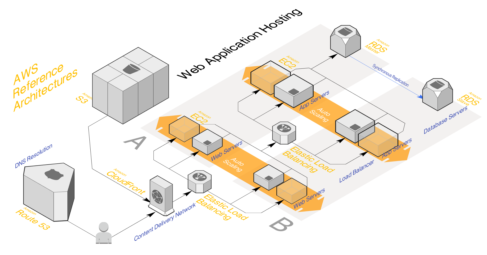

# G705

## Project Abstract: 
**SmartSense** is an industrial monitoring system that analyzes vibration, pressure, and temperature sensor data to 
enable predictive maintenance of machinery.

## Project Team:
1. **Margarida Cardoso - 125799 - Team Manager**
2. **Tiago Costa - 125943 - Product Owner**
3. **Pedro Rocha - 125296 - Architect**
4. **Daniel Martins - 115868 - DevOps Master**

## Architecture Diagram:

## Project Bookmarks:
1. **[Repository link](https://github.com/detiuaveiro/ies2526-group-project-g705)**
2. **[Github Project link](https://github.com/orgs/detiuaveiro/projects/222/views/1)**
