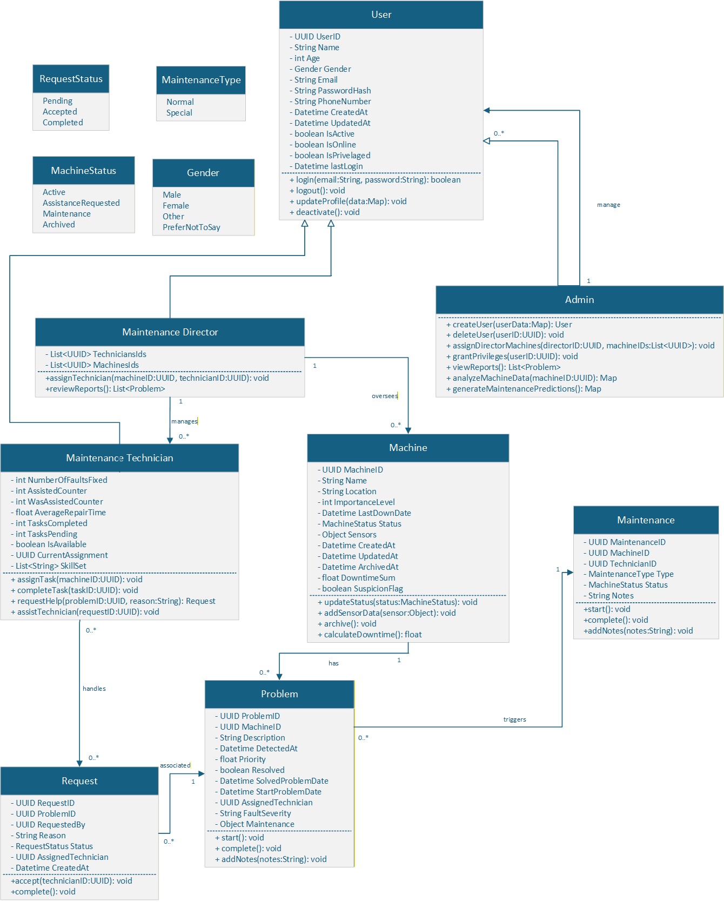

# Project Specification: Industrial Monitoring System
---

# 1. Project Theme

#### Concept
>An industrial monitoring system that analyzes vibration, pressure, and temperature sensor data to enable predictive maintenance of machinery.

#### Data Acquisition Layer
>Virtual or physical sensors that continuously collect:
>1. Vibration (Hz)
>2. Pressure (bar)
>3. Temperature (°C)  
>from machines.

#### Data Publishing
>1. Each sensor has a *site gateway* acting as a local aggregator.
>2. The telemetry data is sent to the cloud using a bandwidth-savvy >protocol.

#### Processing & Business Logic
>1. Hazard conditions are detected when telemetry reveals operating >thresholds are compromised.
>2. Alarms are forwarded to the mobile devices of the people in charge.

#### Integration API
>Exposes endpoints to programmatically list industrial assets:  
>1- Location
>2- Model
>3- Specifications
>Provides access to telemetry readings:  
>4- Current status
>5- Historical data intervals
>Enables external integration with other systems.  

#### Web Portal
>Web-based dashboard for real-time tracking of:  
>1. Machine health  
>2. Operational conditions  

---

# 2. Personas

##  João Neves — Maintenance Technician  

**Age:** 26  
**Occupation:** Maintenance Technician 
**Location:** Lisbon, Portugal

#### **Background**
João is a Maintenance Technician at SmartSence and is relatively new at the company. He is responsible for checking  systems and equipment, making sure everything runs smoothly. João enjoys understanding how each machine works and values an organized and safe work environment.

#### **Daily Life**
In his daily life, João performs regular inspections and tests on equipment, logs any problems, and tries to solve them independently before involving the Maintenance Director. He uses manuals, digital tools, and monitoring software to diagnose failures. Even when faced with unexpected problems, João always tries to stay calm and ensure the company’s systems run smoothly.

#### **Goals & Needs**
João wants to get promoted to Maintenance Director and increase his salary to support his family. He also wants to improve his technical skills and learn new maintenance technologies to stand out in the company. For him, career growth means recognition and financial security.

#### **Motivation**
What drives João is the desire to be recognized for his effort and work, as well as to have professional stability. He wants to feel that his contributions truly matter and that his growth is valued by the company.

---

##  Manuel Gomes — Maintenance Director  

**Age:** 34  
**Occupation:** Maintenance Director 
**Location:** Lisbon, Portugal

#### **Background**
Manuel has been working at SmartSence for many years and knows all the company’s systems and equipment inside out. He leads the maintenance team and is responsible for ensuring that all sensors, machines, and systems run smoothly. Manuel values organized processes, operational safety, and team efficiency.

#### **Daily Life**
In his daily life, Manuel reviews the full history of failures, identifies failure patterns, and assesses the need for more critical actions to prevent bigger issues. He guides technicians like João, provides constant feedback, and decides when to update or replace equipment. His work requires attention to detail and the ability to anticipate problems before they affect company operations.

#### **Goals & Needs**
Manuel wants to keep the company’s operations efficient and safe, ensuring the team works in a coordinated way. He seeks ways to reduce failures and maintenance costs, while also investing in the technical development of his team.

#### **Motivation**
What motivates Manuel is the trust the company places in him and try turn the company better. He values professional recognition a good team, and efficient.

---

##  Sara Lopes — Admnistrator  

**Age:** 32  
**Occupation:** Admnistrator 
**Location:** Lisbon, Portugal

#### **Background**
Sara works at SmartSence as an Admnistrator responsible for overseeing operational efficiency, team organization, and equipment management. She has extensive experience in operations and team coordination, ensuring that both technical teams and company resources are used effectively.

#### **Daily Life**
In her daily work, Sara reviews machine performance reports and operational data provided by the maintenance team. She monitors indicators such as operating time, failures, maintenance interventions, and equipment costs.
She also checks whether technicians are completing their assigned tasks on time and ensures that all machines and equipment are properly registered in the system. Sara frequently communicates with the Maintenance Director and technical teams to make sure operations run smoothly and everyone is aligned.

#### **Goals & Needs**
Sara wants to maintain an efficient and well-organized operation. She needs clear information about machine performance, maintenance activities, and team productivity in order to decide whether equipment should continue operating or be replaced.

#### **Motivation**
Sara is motivated by improving operational efficiency and helping the company grow while maintaining high quality standards. She enjoys seeing teams working productively, processes running smoothly, and the organization operating in a clear and structured way.

---

# 3. User Stories

### User Story 1:
**As a** Maintenance Technician,  
**I want** to know if there is a machine with a breakdown,  
**so that** I can fix it.  
	
Description: No details added (to be added as the project develops).

#### Acceptance Criteria:
**Given** the user is logged in the system  
**And** the user has the role of Maintenance Technician  
**When** they navigate to the 'Machines' tab  
**Then** a tab labeled 'Machines' should be visible.  

---
### User Story 2:
**As a** Maintenance Technician,  
**I want** to monitor early warning signs from the machines,  
**so that** I can perform preventive repairs before a total breakdown occurs.

Description: No details added (to be added as the project develops).

#### Acceptance Criteria:
**Given** the user is logged into the system   
**And** the user has the role of "Maintenance Technician"  
**When** the user is viewing a machine’s Individual Dashboard  
**Then** a section labeled "Health Status" should be visible  
**And** the section should display:  
1. A vibration trend graph (time vs value)  
2. A pressure trend graph (time vs value)  
3. A temperature trend graph (time vs value)  
And each graph should clearly label the time axis and the value axis 

---
### User Story 3:
**As a** Maintenance Technician,  
**I want** to view each machine's priority level based on its importance, downtime, and fault severity,  
**so that** I can optimize my workflow and fix the most critical issues first.

Description: No details added (to be added as the project develops).

#### Acceptance Criteria:
**Given** the user is logged into the system
**When** the user navigates to the machine overview or ranking section
**Then** the system should display a ranking of machines
**And** the ranking should determine the priority order of the machines

---
### User Story 4:
**As a** Maintenance Technician,  
**I want** to request assistance for a machine in the app when a repair requires additional help,  
**so that** my colleagues are notified and can assist me.

Description: No details added (to be added as the project develops).

#### Acceptance Criteria:
**Given** the Maintenance Technician has completed the assistance request form  
**When** the Technician submits the request  
**Then** the system should notify the "Maintenance Director"
**And** the notification should include:  
1. The machine identifier
2. The location
3. The reason for assistance
4. The timestamp of the request

---

### User Story 5:
 **As a** Maintenance Director,  
**I want** to know if there is a machine that has been having several breakdowns,  
**so that** I can investigate a more serious fault.

Description: No details added (to be added as the project develops).

#### Acceptance Criteria:
**Given** the user is logged in the system  
**And** the user has the role of Maintenance Director  
**When** they navigate to the 'Machines' tab
**Then** a section labled 'History' should be visible, where information regarding the machine should be visible, such as title, description and previous breakdowns ordered by their date.

---
### User Story 6:
**As a** Maintenance Director,  
**I want** to choose the technicians that can help when there is a request sent by another technician,
**so that** the machine can be fixed quicker.

Description: No details added (to be added as the project develops).

#### Acceptance Criteria:
**Given** the user is logged in the system  
**And** the user has the role of Maintenance Director  
**When** they navigate to the 'Requests' tab
**Then** a section labled 'Requests' should be visible, where information regarding the request, such as
1. description
2. name of the techician who asked for help
3. location
4. machine's name
**And** a button/dropdown for the director assign people, for each request

---
### User Story 7:
**As an** Administrator,  
**I want** to monitor the technicians' performance,  
**so that** I can ensure the maintenance team is meeting productivity expectations.

Description: No details added (to be added as the project develops).

#### Acceptance Criteria:
**Given** the user is logged into the system  
**And** the user has the role of "Administrator"  
**When** the user navigates to the main interface  
**Then** a tab labeled "Team" should be visible  

---
### User Story 8:
**As a** Administrator,  
**I want** to register new equipment/machines in the app,  
**so that** the maintenance team can start tracking its performance and history.

Description: No details added (to be added as the project develops).

#### Acceptance Criteria:
**Given** the user is logged into the system  
**And** the user has the role of "Administrator"  
**When** the user navigates to the main interface  
**Then** a tab labeled "Managing" should be visible  

---
### User Story 9:
**As a** Administrator,  
**I want** to remove equipment/machines from the app,  
**so that** the views of every user remain updated.

Description: No details added (to be added as the project develops).

#### Acceptance Criteria:
**Given** the user is logged in as a Administrator  
**And** the equipment exists in the system  
**When** the user clicks the “Delete” button for that equipment  
**And** confirms the deletion  
**Then** the equipment is removed from all user views immediately  
**And** a success message “Equipment deleted successfully” is displayed  
**And** the deletion is logged in the system audit trail  

---
### User Story 10:
**As a** Administrator,  
**I want** to access the history of removed machines,  
**so that** I can review past performance, costs, and maintenance records for several purposes.

Description: No details added (to be added as the project develops).

#### Acceptance Criteria:
**Given** the user is logged into the system  
**And** the user has the role of "Administrator"  
**When** the user navigates to the main interface  
**Then** a section labeled "Archived" should be visible  
**And** this section should provide access to removed or deactivated machines  

---
# 4. Scenarios
### Scenario 1 — User Authentication

   #### Actors:
        User (Administrator, Maintenance Director, Maintenance Technician)

   #### Description:
        A user makes the login in the system to access the platform according to their role.

   #### Steps:

        1- The user use their username and password.
        2- The system verifies the credentials.
        3- The system identifies the user role.
        4- The system give the access to the functionalities allowed for that role.

   #### Relationships involved: 

   ###### Inheritance:
            Administrator, Maintenance Director and Maintenance Technician inherit from the User class.

   ###### Dependency:
            The authentication system depends on the User entity to validate credentials.
---
### Scenario 2 — Registering a Machine

   #### Actors: 
        Administrator

   #### Description:
        The administrator registers a new machine in the system.

   #### Steps:

        1- The administrator accesses the machine management module.
        2- The administrator writes the machine details (ID, name, location, sensors).
        3- The system validates the information.
        4- The machine information is stored in the system database.

   #### Relationships involved:

   ###### Association:
            A Machine is associated with multiple Sensors.

   ###### Dependency:
            The system depends on the Machine entity to store operational information.
---
### Scenario 3 — Sensor Information Collection

   #### Actors: 
        System (Sensors)

   #### Description:
        Sensors collect information from machines.

   #### Steps:

        1- The sensors measure vibration, pressure, and temperature.
        2- The information is sent to the system.
        3- The system stores the information in the database.
        4- The information becomes available for monitoring and analysis.

#### Relationships involved:

   ###### Association:
            A Machine is associated with multiple sensors.

   ###### Dependency:
            The Failure Manager depends on sensor data to detect anomalies.
---
### Scenario 4 — Error Detection

   #### Actors: 
        Error Manager (System)

   #### Description:
        The system analyzes sensor information to detect errors from the sensors.

   #### Steps:

        1- The system analyzes recent sensor information.
        2- The Failure Manager detects anormal patterns.
        3- The system generates an error.
        4- The error is stored in the system logs and made visible to the Maintenance Director.

   #### Relationships involved:

   ######  Dependency:
            Error Manager depends on Sensor.

   ###### Association:
            An error is associated with a specific Machine.
---
### Scenario 5 — Assigning Maintenance

   #### Actors: 
        Maintenance Director

   #### Description:
        The Maintenance Director gives a maintenance task to a maintenance technician.

   #### Steps:

        1- The Maintenance Director reviews the issue report.
        2- The director selects a technician.
        3- The system creates a maintenance record.
        4- The technician is notified about the assigned task.

   #### Relationships involved:

   ######  Association:
            Maintenance is associated with the Machine(system) and a Maintenance Technician.

   ######  Inheritance:
            Normal Maintenance and Special Maintenances inherit from Maintenance.
---
### Scenario 6 — Maintenance Technician Sends a Request

   #### Actors: 
        Maintenance Technician

   #### Description:
        A technician sends a request for additional resources during maintenance.

   #### Steps:

        1- The Maintenance Technician accesses the maintenance task.
        2- The Maintenance Technician creates a request describing the needed resources.
        3- The system stores the request.
        4- The Maintenance Director receives the request.

   #### Relationships involved:

   ######  Association:
        The request is associated with a Maintenance Technician.

   ######  Dependency:
        The Maintenance Director needs the request information to make a decision.

---

# 5. System Requirements

### Functional Requirements
* **FR1:** The system shall support different types of users.
* **FR2:** The system shall authenticate users before allowing access to system functionalities.
* **FR3:** The system shall restrict and allow access to certain functionalities based on the user type.
* **FR4:** The system shall store machine information (e.g., identification, status, and operational data).
* **FR5:** The system shall allow machine information to be updated.
* **FR6:** The system shall collect data from vibration, pressure, and temperature sensors.
* **FR7:** The system shall store historical sensor data for future analysis.
* **FR8:** The system shall automatically generate an issue record when a failure is detected.
* **FR9:** The system shall record maintenance activities performed and those that are still pending.
* **FR9:** The system shall allow maintenance technicians to send requests.

### Non-Functional Requirements
* **NFR1:** The system shall process sensor data in near real time.
* **NFR2:** The system shall support the monitoring of multiple machines simultaneously.
* **NFR3:** The system shall ensure the integrity of data collected from sensors.
* **NFR4:** The system shall ensure secure user authentication.
* **NFR5:** The system shall log user activities.
* **NFR6:** The system interface shall be simple and intuitive for technicians and managers.
* **NFR7:** The system shall allow new machines and sensors to be added without significant performance degradation.
* **NFR8:** The system shall allow future integration with new monitoring technologies.

---

# 6. System Entities and Domain Structure

## 6.1. User (Base Class)

All roles inherit from this base class.

| Field | Type | Description |
|-------|------|-------------|
| IdentificationPhotoUrl | string | Path to the user's picture|
| UserID | UUID / int | Unique identifier |
| Name | string | Full name |
| Age | int | Optional |
| Gender | enum | Male / Female / Other / Prefer not to say |
| Email | string | Login and notifications |
| PasswordHash | string | For authentication |
| PhoneNumber | string | Optional |
| CreatedAt | datetime | Account creation timestamp |
| UpdatedAt | datetime | Last update timestamp |
| IsActive | boolean | Active/inactive account |
| IsOnline | boolean | Is/Isn't using the app in that moment |
| IsPrivelaged | boolean | Is/in't an admin |
| lastLogin | Datetime | Last time the user logged in |

## 6.2. Maintenance Technician (inherits User)

| Field | Type | Description |
|-------|------|-------------|
| NumberOfFaultsFixed | int | Total faults fixed |
| AssistedCounter | int | Times helped other technicians |
| WasAssistedCounter | int | Times required help from another techinician |
| AverageRepairTime | float | Average repair time (hours/minutes) |
| TasksCompleted | int | Number of completed tasks |
| TasksPending | int | Number of pending tasks |
| IsAvailable | boolean | Currently available for assignments |
| CurrentAssignment | MachineID / nullable | Machine currently assigned |
| SkillSet | array of strings | Types of machines they specialize in |

## 6.3. Maintenance Director(inherits User)

| Field | Type | Description |
|-------|------|-------------|
| TechniciansIds | array of UserID | Ids of the Techinicias managed by the Director |
| MachinesIds | array of MachineID | Ids of the Machines managed by the Director |

> Admin inherits User and has all permissions by default.

## 6.4. Machine

| Field | Type | Description |
|-------|------|-------------|
| IdentificationPhotoUrl | string | Path to the machine's picture|
| MachineID | UUID / int | Unique identifier |
| Name | string | Machine name or identifier |
| Location | string | Physical location |
| ImportanceLevel | int | |
| LastDownDate | datetime | Time offline |
| Status | enum | Active / Assistance Requested / Maintenance / Archived |
| Sensors | object | Sensor readings: vibration, pressure, temperature |
| CreatedAt | datetime | Registration date |
| UpdatedAt | datetime | Last update |
| ArchivedAt | datetime / nullable | When machine was removed |
| DowntimeSum | float | Sum of all downtimes are are calculated |
| SuspicionFlag | boolean | Sensors suspect the machine might be broken |

## 6.5. Problem (Fault / Defect)

| Field | Type | Description |
|-------|------|-------------|
| ProblemID | UUID | Unique ID |
| MachineID | UUID | Machine related to problem |
| Description | string | Short description of the issue |
| DetectedAt | datetime | Time the fault was detected |
| Priority | float | Fault priority |
| Resolved | boolean | Whether it’s fixed |
| SolvedProblemDate | datetime | Date when the problem was resolved |
| StartProblemDate | datetime | Date when the problem was issued |
| ResolutionTime |  | Time it was resolved |
| AssignedTechnician | UserID / nullable | Technician handling the problem |
| FaultSeverity | int / string | Numeric or short description |
| Maintenance | object | Maintenance associated with the problem |

## 6.6. Maintenance (Normal / Special)

| Field | Type | Description |
|-------|------|-------------|
| MaintenanceID | UUID | Unique ID |
| MachineID | UUID | Target machine |
| TechnicianID | UUID | Assigned technician |
| Type | enum | Normal / Special |
| Status | enum | Pending / In Progress / Completed |
| Notes | text | Optional notes |

## 6.7. Request (Assistance)

| Field | Type | Description |
|-------|------|-------------|
| RequestID | UUID | Unique ID |
| ProblemID | UUID | Problem associated |
| RequestedBy | UserID | Technician requesting help |
| Reason | string | Reason for assistance |
| Status | enum | Pending / Accepted / Completed |
| AssignedTechnician | UserID / nullable | Technician giving assistance |
| CreatedAt | datetime | Request time |

## 6.8. Relationships Overview

- **User → Technician / Director** (inheritance)  
- **Machine → Problem** (1-to-many)  
- **Problem → Maintenance** (1-to-many)  
- **Request → Problem** (many-to-1)  

##  UML Class Diagram

---

# 4. Software Architecture Notebook

## Architectural Pattern 
For the development of our application, we opted to follow one of the most common software architecture patterns: the `Layered Architecture Pattern`.

The `Layered Architecture Pattern` enables us to divide our application’s logic into three layers that address the main aspects of the system: database, backend, and frontend.

We chose this pattern for its simplicity and flexibility, as it is widely used and allows for the separation of business logic from presentation logic, while abstracting database operations. It also aligns well with our project’s needs and requirements and our development team's size.

---
## Technology Decisions
The backend will be developed using `Spring Boot`, the database is a relational `PostgreSQL` instance, and the frontend will be built with `HTML`, `JavaScript`, and `CSS`.

Following the project guidelines provided by the professors, we chose to containerize both our application and the database into two separate `Docker` containers. These containers communicate with each other through a dedicated `Docker` network.

By containerizing the database in `Docker`, you can spin up a temporary (“disposable”) database for backend development. This allows you to:

- Test your backend without touching the real production database.
- Reset or recreate the database easily whenever you want.
- Share the development environment with your team in a consistent state.

The database and the application will include `JPA / Hibernate / JDBC` as the communication method.

The `Controller Layer` will communicate with the `Presentation Layer` through `HTTP Protocol Requests`, passed through the `Rest API`.

---
## Deployment Diagram
The deployment diagram allows us to visualize the organization of the servers and deployed containers.

### 1. Spring Boot Application Container (`G705-app`)
- **Artifact:** Built from `./projX/Dockerfile` → `myapp.jar`
- **Port:** 8080 (HTTP)
- **Layers inside container:**
  - **Controller:** Handles HTTP requests
  - **Service:** Business logic
  - **Repository:** Data access
  - **Domain:** Entities / models
- **Environment Variables:**
  - `SPRING_PROFILES_ACTIVE=prod`
  - `SPRING_DATASOURCE_URL=jdbc:postgresql://postgres:5432/g705`
  - `SPRING_DATASOURCE_USERNAME=g705user`
  - `SPRING_DATASOURCE_PASSWORD=g705password`
- **Dependency:** Starts after `G705-db` container

### 2. PostgreSQL Container (`G705-db`)
- **Image:** `postgres:16-alpine`
- **Database:** `g705`
- **User / Password:** `g705user / g705password`
- **Port:** 5432 (internal)
- **Persistence:** Volume `postgres_data`

### 3. Connections
- `G705-app` → `G705-db`: JDBC connection (port 5432)
- Users / Clients → `G705-app`: HTTP requests (port 8080)
---
## Component Diagram

The `SpringBoot Application` is split up into a series of layers.

- The `Domain Layer` contains information about the different entities that populate the system.
It stores nuclear information regarding these entities such as their fields/attributes, behaviours and relationships with eachother, such as inheritance or composition.

- The `Repository Layer` is responsible for providing an interface capable of communicating with the database, directly from a `JAVA` environment.

- The `Service Layer` houses most of the application's business logic.

- The `Controller Layer` will be responsible for containing the `Rest API` endpoints which interact with an external `Presentation Layer` through `HTTP Requests`.
  - After establishing the `Domain` structure, we've decided that the endpoint distribution should consist in 6 different controllers:

  |Controller| Role|
  |---|---|
  |`AuthController`| Handles authentication and security|
  |`UserController`| Manages user accounts and role-based user operations.|
  |`Machine Controller`|Manages machines and their operational status.|
  |`ProblemController`|Manages machine faults and technician assignments.|
  |`MaintenanceController`|Manages maintenance tasks and their progress.|
  |`RequestController`|Manages technician assistance requests and collaboration.|
  

- The `Presentation Layer` will provide a `GUI`, resulting in a `Web Application`, which is then provided to the client for them to use.

The database built in `PostgrSQL` maps each class inside of the `domain` folder into it's own data table, under a common schema.

