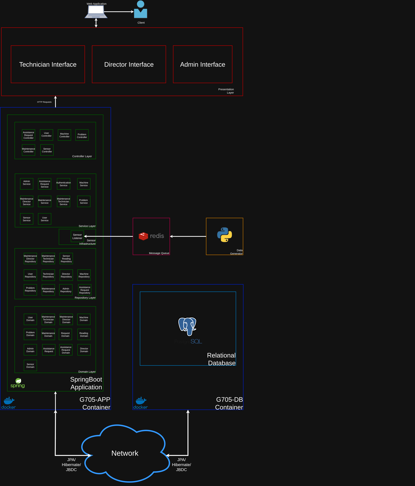
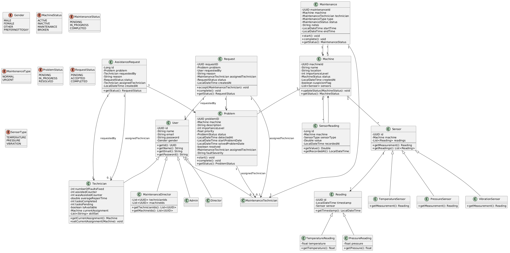

# Project Specification: Industrial Monitoring System
---

# 1. Project Theme

#### Concept
>An industrial monitoring system that analyzes vibration, pressure, and temperature sensor data to enable predictive maintenance of machinery.

#### Data Acquisition Layer
>Virtual or physical sensors that continuously collect:
>1. Vibration (Hz)
>2. Pressure (bar)
>3. Temperature (°C)  

#### Data Publishing
>1. Each sensor has a *site gateway* acting as a local aggregator.
>2. The telemetry data is sent to the cloud using a bandwidth-savvy protocol.

#### Processing & Business Logic
>1. Hazard conditions are detected when telemetry reveals operating thresholds are compromised.
>2. People in charge get that information on their UI.

#### Integration API
>Exposes endpoints to programmatically list industrial assets:  
>1. Location
>2. Model
>3. Specifications 

Provides access to telemetry readings:  
>4. Current status
>5. Historical data intervals
>Enables external integration with other systems.  

#### Web Portal
>Web-based dashboard for real-time tracking of:  
>1. Machine health  
>2. Operational conditions  

---

# 2. Personas

##  João Neves — Maintenance Technician  

**Age:** 26  
**Occupation:** Maintenance Technician 
**Location:** Lisbon, Portugal

#### **Background**
João is a Maintenance Technician at SmartSense and is relatively new at the company. He is responsible for checking  systems and equipment, making sure everything runs smoothly. João enjoys understanding how each machine works and values an organized and safe work environment.

#### **Daily Life**
In his daily life, João performs regular inspections and tests on equipment, logs any problems, and tries to solve them independently before involving the Maintenance Director. He uses manuals, digital tools, and monitoring software to diagnose failures. Even when faced with unexpected problems, João always tries to stay calm and ensure the company’s systems run smoothly.

#### **Goals & Needs**
João wants to get promoted to Maintenance Director and increase his salary to support his family. He also wants to improve his technical skills and learn new maintenance technologies to stand out in the company. For him, career growth means recognition and financial security.

#### **Motivation**
What drives João is the desire to be recognized for his effort and work, as well as to have professional stability. He wants to feel that his contributions truly matter and that his growth is valued by the company.

---

##  Manuel Gomes — Maintenance Director  

**Age:** 34  
**Occupation:** Maintenance Director 
**Location:** Lisbon, Portugal

#### **Background**
Manuel has been working at SmartSense for many years and knows all the company’s systems and equipment inside out. He leads the maintenance team and is responsible for ensuring that all sensors, machines, and systems run smoothly. Manuel values organized processes, operational safety, and team efficiency.

#### **Daily Life**
In his daily life, Manuel reviews the full history of failures, identifies failure patterns, and assesses the need for more critical actions to prevent bigger issues. He guides technicians like João and provides constant feedback. His work requires attention to detail and the ability to anticipate problems before they affect company operations.

#### **Goals & Needs**
Manuel wants to keep the company’s operations efficient and safe, ensuring the team works in a coordinated way. He seeks ways to reduce failures and maintenance costs, while also investing in the technical development of his team.

#### **Motivation**
What motivates Manuel is the trust the company places in him and try turn the company better. He values professional recognition, a good team and efficience.

---

##  Sara Lopes — Admnistrator  

**Age:** 32  
**Occupation:** Admnistrator 
**Location:** Lisbon, Portugal

#### **Background**
Sara works at SmartSense as an Admnistrator responsible for overseeing operational efficiency, team organization, and equipment management. She has extensive experience in operations and team coordination, ensuring that both technical teams and company resources are used effectively.

#### **Daily Life**
In her daily work, Sara reviews machine performance reports and operational data. She monitors indicators such as operating time, failures and maintenance interventions.
She also checks whether technicians are completing their assigned tasks on time and ensures that all machines and equipment are properly registered in the system. Sara frequently communicates with the Maintenance Director and technical teams to make sure operations run smoothly and everyone is aligned.

#### **Goals & Needs**
Sara wants to maintain an efficient and well-organized operation. She needs clear information about machine performance, maintenance activities, and team productivity in order to decide whether equipment should continue operating or be replaced.

#### **Motivation**
Sara is motivated by improving operational efficiency and helping the company grow while maintaining high quality standards. She enjoys seeing teams working productively, processes running smoothly, and the organization operating in a clear and structured way.

---

# 3. User Stories

### User Story 1:
**As a** Maintenance Technician,  
**I want** to know if there is a machine with a breakdown,  
**so that** I can fix it.  
	
Description: No details added (to be added as the project develops).

#### Acceptance Criteria:
**Given** the user is logged in the system  
**And** the user has the role of Maintenance Technician  
**When** they navigate to the 'Machines' tab  
**Then** a tab labeled 'Machines' should be visible.  

---
### User Story 2:
**As a** Maintenance Technician,  
**I want** to monitor early warning signs from the machines,  
**so that** I can perform preventive repairs before a total breakdown occurs.

Description: No details added (to be added as the project develops).

#### Acceptance Criteria:
**Given** the user is logged into the system   
**And** the user has the role of "Maintenance Technician"  
**When** the user is viewing a machine’s Individual Dashboard  
**Then** a section labeled "Health Status" should be visible  
**And** the section should display:  
1. A vibration trend graph (time vs value)  
2. A pressure trend graph (time vs value)  
3. A temperature trend graph (time vs value)  
And each graph should clearly label the time axis and the value axis 

---
### User Story 3:
**As a** Maintenance Technician,  
**I want** to view each machine's priority level based on its importance, downtime, and fault severity,  
**so that** I can optimize my workflow and fix the most critical issues first.

Description: No details added (to be added as the project develops).

#### Acceptance Criteria:
**Given** the user is logged into the system
**When** the user navigates to the machine overview or ranking section
**Then** the system should display a ranking of machines
**And** the ranking should determine the priority order of the machines

---
### User Story 4:
**As a** Maintenance Technician,  
**I want** to request assistance for a machine in the app when a repair requires additional help,  
**so that** my colleagues are notified and can assist me.

Description: No details added (to be added as the project develops).

#### Acceptance Criteria:
**Given** the Maintenance Technician has completed the assistance request form  
**When** the Technician submits the request  
**Then** the system should notify the "Maintenance Director".

---

### User Story 5:
 **As a** Maintenance Director,  
**I want** to know if there is a machine that has been having several breakdowns,  
**so that** I can investigate a more serious fault.

Description: No details added (to be added as the project develops).

#### Acceptance Criteria:
**Given** the user is logged in the system  
**And** the user has the role of Maintenance Director  
**When** they navigate to the 'Machines' tab
**Then** a section labled 'History' should be visible, where information regarding the machine should be visible, such as title, description and previous breakdowns ordered by their date.

---
### User Story 6:
**As a** Maintenance Director,  
**I want** to choose the technicians that can help when there is a request sent by another technician,
**so that** the machine can be fixed quicker.

Description: No details added (to be added as the project develops).

#### Acceptance Criteria:
**Given** the user is logged in the system  
**And** the user has the role of Maintenance Director  
**When** they navigate to the 'Requests' tab
**Then** a section labled 'Requests' should be visible, where information regarding the request, such as
1. description
2. name of the techician who asked for help
3. location
4. machine's name

**And** a button/dropdown for the director assign people, for each request

---
### User Story 7:
**As an** Administrator,  
**I want** to monitor the technicians' performance,  
**so that** I can ensure the maintenance team is meeting productivity expectations.

Description: No details added (to be added as the project develops).

#### Acceptance Criteria:
**Given** the user is logged into the system  
**And** the user has the role of "Administrator"  
**When** the user navigates to the main interface  
**Then** a tab labeled "Team" should be visible  

---
### User Story 8:
**As a** Administrator,  
**I want** to register new equipment/machines in the app,  
**so that** the maintenance team can start tracking its performance and history.

Description: No details added (to be added as the project develops).

#### Acceptance Criteria:
**Given** the user is logged into the system  
**And** the user has the role of "Administrator"  
**When** the user navigates to the main interface  
**Then** a tab labeled "Managing" should be visible  

---
### User Story 9:
**As a** Administrator,  
**I want** to remove equipment/machines from the app,  
**so that** the views of every user remain updated.

Description: No details added (to be added as the project develops).

#### Acceptance Criteria:
**Given** the user is logged in as a Administrator  
**And** the equipment exists in the system  
**When** the user clicks the “Delete” button for that equipment  
**And** confirms the deletion  
**Then** the equipment is removed from all user views immediately  
**And** a success message “Equipment deleted successfully” is displayed  
**And** the deletion is logged in the system audit trail  

---
### User Story 10:
**As a** Administrator,  
**I want** to access the history of removed machines,  
**so that** I can review past performance, costs, and maintenance records for several purposes.

Description: No details added (to be added as the project develops).

#### Acceptance Criteria:
**Given** the user is logged into the system  
**And** the user has the role of "Administrator"  
**When** the user navigates to the main interface  
**Then** a section labeled "Archived" should be visible  
**And** this section should provide access to removed or deactivated machines  

---
## Scenario 1 — User Authentication
   ### Actors:
     User (Administrator, Maintenance Director, Maintenance Technician)
     
   ### Description:
     A user logs into the system to access functionalities based on their role.

   ### Steps:

     1. The user enters their username and password.
     2. The system verifies the credentials.
     3. The system identifies the user role.
     4. The system gives access to functionalities based on the role.

   ### Relationships:

   #### Inheritance:
          Administrator, Maintenance Director, and Maintenance Technician inherit from User

   #### Dependency: 
          Authentication system depends on the User credentials and rules
---
## Scenario 2 — Registering a Machine
   ### Actors:
     Administrator

   ### Description:
     The administrator registers a new machine in the system.

   ### Steps:

     1. The administrator accesses the machine management module.
     2. The administrator inputs machine details (ID, name, location, sensors).
     3. The system validates the information.
     4. The system stores the machine in the database.

   ### Relationships:

   #### Association:
          A Machine is associated with multiple Sensors.

   #### Dependency:
          The system depends on the Machine entity to store information.
---
## Scenario 3 — Sensor Information Collection
   ### Actors:
     System (Sensors)

   ### Description:
     The sensors collect information from the machines.

   ### Steps:

     1. The sensors measure vibration, pressure, and temperature.
     2. The information is sent to the system.
     3. The system stores the information in the database.
     4. The information becomes available for monitoring and analysis.

   ### Relationships:

   #### Association:
          A Machine is associated with multiple Sensors.

   #### Dependency:
          The Failure Manager depends on sensor data.
---
## Scenario 4 — Error Detection
   ### Actors:
     Error Manager (System)

   ### Description:
     The system analyzes sensor information to detect errors.

   ### Steps:
     1. The system analyzes the latest sensor information.
     2. The system detects strange patterns.
     3. The system gives an error.
     4. The error is stored in the system logs.
     5. The error is made visible to the Maintenance Director.

   ### Relationships:

   #### Dependency:
          Error Manager depends on Sensor data.

   #### Association:
          An error is associated with a Machine.
---
## Scenario 5 — Assigning Maintenance
   ### Actors:
     Maintenance Director

   ### Description:
     The Maintenance Director gives a maintenance task to a maintenance technician.

   ### Steps:

     1. The Maintenance Director reviews the error notification.
     2. The director selects a maintenance technician.
     3. The system creates a maintenance notification.
     4. The technician is notified.

   ### Relationships:

   #### Association:
          Maintenance is associated with a Machine and a Maintenance Technician.

   #### Inheritance:
          Normal Maintenance and Special Maintenance inherit from Maintenance.
---
## Scenario 6 — Maintenance Technician Sends a Request
   ### Actors:
     Maintenance Technician

   ### Description:
     A maintenance technician sends a request for additional help during the maintenance.

   ### Steps:

     1. The maintenance technician accesses the task.
     2. The maintenance technician creates a request asking for help and report additional information.
     3. The system stores the request.
     4. The maintenance director receives the request.

   ### Relationships:

   #### Association:
          The Request is associated with a Maintenance Technician.

   #### Dependency:
          The Maintenance Director depends on the request information.

## Scenario 7 — Monitoring Machines
   ### Actors:
     Maintenance Technician, Maintenance Director, Administrator

   ### Description:
     Users monitor the machines and their information.

   ### Steps:

     1. The user accesses the system interface.
     2. The system displays their health status.
     3. The system displays the sensors information:
        - Vibration
        - Pressure
        - Temperature
     4. The user analyzes the machine data.

   ### Relationships:

   #### Association:
          Machine is associated with Sensors.

   #### Dependency:
          Monitoring depends on sensor data.

## Scenario 8 — Removing a Machine
   ### Actors:
     Administrator

   ### Description:
     The administrator removes a machine from the system.

   ### Steps:

     1. The administrator selects a machine.
     2. The administrator clicks in the delete option.
     3. The system asks for confirmation.
     4. The administrator confirms the deletion.
     5. The system removes the machine.
     6. The system displays a success message.
     7. The action is logged in the system.

   ### Relationships:

   #### Dependency:
          The system depends on the Machine entity.

   #### Dependency:
          The system logs user actions.

## Scenario 9 — Viewing Archived Machines
   ### Actors:
     Administrator

   ### Description:
     The administrator accesses removed machines.

   ### Steps:

     1. The administrator navigates to the "Archived" section
     2. The system displays all the removed machines
     3. The administrator reviews the historical data and the reassons.

   ### Relationships:

   #### Association:
          Machine is associated with a historical data

   #### Dependency:
          The system depends on stored information

---

# 4. Architecture

---

# 5. System Requirements

### Functional Requirements
* **FR1:** The system shall support different types of users.
* **FR2:** The system shall authenticate users before allowing access to system functionalities.
* **FR3:** The system shall restrict and allow access to certain functionalities based on the user type.
* **FR4:** The system shall store machine information (e.g., identification, status, and operational data).
* **FR5:** The system shall allow machine information to be updated.
* **FR6:** The system shall collect data from vibration, pressure, and temperature sensors.
* **FR7:** The system shall store historical sensor data for future analysis.
* **FR8:** The system shall automatically generate an issue record when a failure is detected.
* **FR9:** The system shall record maintenance activities performed and those that are still pending.
* **FR9:** The system shall allow maintenance technicians to send requests.

### Non-Functional Requirements
* **NFR1:** The system shall process sensor data in near real time.
* **NFR2:** The system shall support the monitoring of multiple machines simultaneously.
* **NFR3:** The system shall ensure the integrity of data collected from sensors.
* **NFR4:** The system shall ensure secure user authentication.
* **NFR5:** The system shall log user activities.
* **NFR6:** The system interface shall be simple and intuitive for technicians and managers.
* **NFR7:** The system shall allow new machines and sensors to be added without significant performance degradation.
* **NFR8:** The system shall allow future integration with new monitoring technologies.

---

# 6. System Entities and Domain Structure

## 6.1. User (Base Class)

All roles inherit from this base class.

| Field        | Type        | Description                    |
|-------------|-------------|--------------------------------|
| id          | UUID        | Unique identifier              |
| name        | String      | Full name                      |
| email       | String      | Login and notifications        |
| passwordHash| String      | Hashed password                |
| gender      | enum        | MALE/FEMALE/OTHER/PREFERNOTTOSAY |
| phoneNumber | String      | Optional                       |
| createdAt   | datetime    | Account creation timestamp     |
| isPrivileged| boolean     | Admin-like privileges          |

Subclasses:
- `Technician`
- `MaintenanceTechnician`
- `MaintenanceDirector`
- `Admin`

---

## 6.2. Technician

Represents a maintenance technician with performance metrics.

| Field               | Type        | Description |
|---------------------|-------------|-------------|
| numberOfFaultsFixed | int         | Number of faults the technician has fixed |
| assistedCounter     | int         | Number of times the technician assisted another |
| wasAssistedCounter  | int         | Number of times the technician required help |
| averageRepairTime   | double      | Average repair time for tasks |
| tasksCompleted      | int         | Total completed tasks |
| tasksPending        | int         | Tasks still pending |
| isAvailable         | boolean     | Whether the technician is available |
| currentAssignment   | Machine     | Machine currently assigned |
| skillSet            | List<String>| Skills and specializations |

---

## 6.3. Maintenance Technician

A specialized technician for maintenance tasks.  
Inherits from `User` and is used specifically for maintenance operations.

| Field | Type | Description |
|-------|------|-------------|
| (inherits all fields from User) | — | — |
| — | — | No additional fields beyond User |

---

## 6.4. Maintenance Director

| Field         | Type        | Description |
|--------------|-------------|-------------|
| technicianIds| List<UUID>  | IDs of technicians managed |
| machineIds   | List<UUID>  | IDs of machines managed |

Inherits from `User`.

---

## 6.5. Machine

| Field           | Type        | Description |
|-----------------|-------------|-------------|
| machineId       | UUID        | Unique identifier |
| name            | String      | Machine name |
| location        | String      | Physical location |
| importanceLevel | int         | Importance for prioritization |
| status          | enum        | ACTIVE / INACTIVE / MAINTENANCE / BROKEN |
| createdAt       | datetime    | Registration timestamp |
| suspicionFlag   | boolean     | Indicates suspected malfunction |
| sensors         | List<Sensor>| Sensors associated with the machine |

---

## 6.6. Maintenance

| Field           | Type                 | Description |
|-----------------|----------------------|-------------|
| maintenanceId   | UUID                 | Unique identifier |
| machine         | Machine              | Machine under maintenance |
| technician      | MaintenanceTechnician| Technician assigned |
| type            | enum                 | NORMAL / URGENT |
| status          | enum                 | PENDING / IN_PROGRESS / COMPLETED |
| notes           | String               | Optional notes |
| startTime       | datetime             | When maintenance started |
| endTime         | datetime             | When maintenance ended |

---

## 6.7. Problem

| Field             | Type                 | Description |
|-------------------|----------------------|-------------|
| problemID         | UUID                 | Unique identifier |
| machine           | Machine              | Machine where the problem occurred |
| description       | String               | Description of the issue |
| importanceLevel   | int                  | Importance of the problem |
| priority          | float                | Calculated priority |
| status            | enum                 | PENDING / IN_PROGRESS / RESOLVED |
| detectedAt        | datetime             | When the problem was detected |
| startProblemDate  | datetime             | When work on the problem started |
| solvedProblemDate | datetime             | When the problem was resolved |
| resolved          | boolean              | Whether the problem is resolved |
| assignedTechnician| MaintenanceTechnician| Technician assigned |
| faultSeverity     | String               | Severity of the fault |

---

## 6.8. Assistance Request

Used for **technician-to-technician assistance**.

| Field               | Type        | Description |
|---------------------|-------------|-------------|
| id                  | Long        | Unique identifier |
| problem             | Problem     | Problem requiring assistance |
| requestedBy         | Technician  | Technician who requested help |
| reason              | String      | Reason for the request |
| status              | enum        | PENDING / ACCEPTED / COMPLETED |
| assignedTechnician  | Technician  | Technician assigned to assist |
| createdAt           | datetime    | Timestamp of request creation |

---

## 6.9. Request (Problem Assistance)

Used for **requests associated with problems**, not technician-to-technician.

| Field               | Type                 | Description |
|---------------------|----------------------|-------------|
| requestID           | UUID                 | Unique identifier |
| problem             | Problem              | Problem associated |
| requestedBy         | User                 | User who created the request |
| reason              | String               | Reason for the request |
| assignedTechnician  | MaintenanceTechnician| Technician assigned |
| status              | enum                 | PENDING / ACCEPTED / COMPLETED |
| createdAt           | datetime             | Timestamp of creation |

---

## 6.10. Sensor & Readings

### Sensor (abstract)

| Field   | Type   | Description |
|---------|--------|-------------|
| id      | UUID   | Unique identifier |
| machine | Machine| Machine where the sensor is installed |
| readings| List<Reading> | Historical readings |

### Reading (abstract)

| Field     | Type        | Description |
|-----------|-------------|-------------|
| id        | UUID        | Unique identifier |
| timestamp | datetime    | When the reading was taken |
| sensor    | Sensor      | Sensor that produced the reading |

### Specialized Readings

| Type                | Extra Field | Description |
|---------------------|-------------|-------------|
| TemperatureReading  | temperature | Temperature in °C |
| PressureReading     | pressure    | Pressure in bar |

### SensorReading (simplified model used by API)

| Field       | Type        | Description |
|-------------|-------------|-------------|
| id          | Long        | Unique identifier |
| machine     | Machine     | Machine associated |
| sensorType  | enum        | TEMPERATURE / PRESSURE / VIBRATION |
| value       | Double      | Reading value |
| recordedAt  | datetime    | Timestamp |

---

## 6.11. Relationships

User -> Technician / MaintenanceTechnician / MaintenanceDirector / Admin (inheritance)

Machine -> Problem (1‑to‑many)

Machine -> Maintenance (1‑to‑many)

Problem -> Request (1‑to‑many)

Problem -> AssistanceRequest (1‑to‑many)

MaintenanceTechnician -> Maintenance (1‑to‑many)

Technician -> AssistanceRequest (1‑to‑many, as requester or assigned helper)
---

# 7. Controllers & API Endpoints

## AuthController
- POST `/auth/login`  
- POST `/auth/register`  

## UserController
- GET `/users`  
- GET `/users/performance`  

## MachineController
- GET `/machines`  
- GET `/machines/{id}`  
- POST `/machines`  

## ProblemController
- GET `/problems`  
- POST `/problems`  
- POST `/problems/{id}/start`  
- POST `/problems/{id}/complete`  

## MaintenanceController
- POST `/maintenance/assign`  
- POST `/maintenance/start`  
- POST `/maintenance/complete`  

## AssistanceRequestController
- GET `/api/v1/requests`  
- GET `/api/v1/requests/{id}`  
- GET `/api/v1/requests/technician/{technicianId}`  
- POST `/api/v1/requests`  
- PUT `/api/v1/requests/{id}`  
- PATCH `/api/v1/requests/{id}/accept`  
- DELETE `/api/v1/requests/{id}`  

## RequestController
- POST `/requests`  
- POST `/requests/{id}/assign`  
- POST `/requests/{id}/complete`  
- GET `/requests`  
- PUT `/requests/{id}/status`  

## SensorController
- GET `/api/v1/sensors/{machineId}`  
- GET `/api/v1/sensors/{machineId}/{type}`  
- GET `/api/v1/sensors/{machineId}/{type}/latest`  
- POST `/api/v1/sensors`  
- DELETE `/api/v1/sensors/{id}`  

---

# 8. Component Layer

The backend is structured into:

- **Domain Layer**  
- **Repository Layer**  
- **Service Layer**  
- **Controller Layer**  

Controllers include:

- AuthController  
- UserController  
- MachineController  
- ProblemController  
- MaintenanceController  
- AssistanceRequestController  
- RequestController  
- SensorController  

---

# 9. UML Class Diagram

---

# 10. Conclusion

This report reflects the **current backend implementation**, aligned with:

- Entities  
- Controllers  
- Services  
- API endpoints  
- Architecture  
- Requirements  
